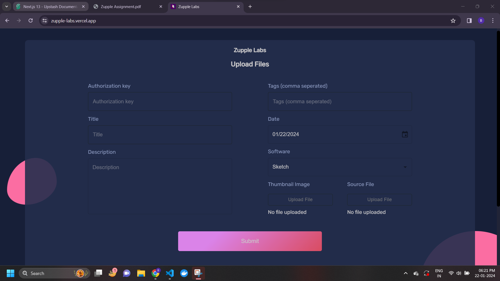
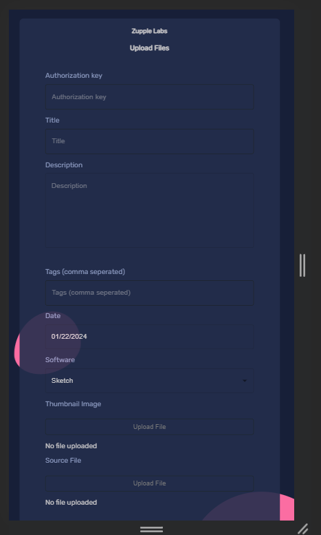
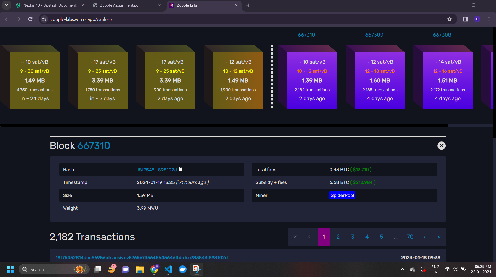
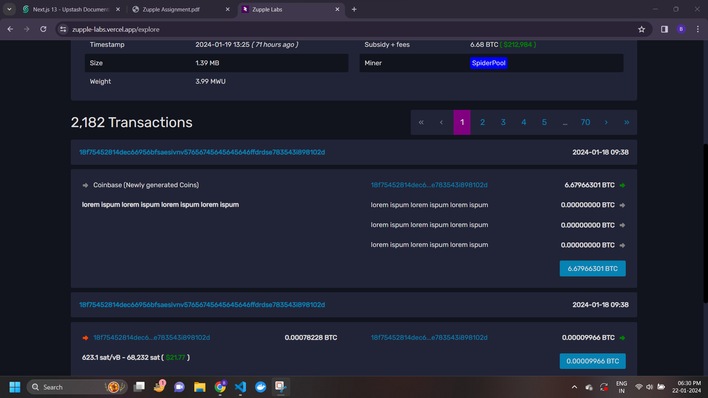
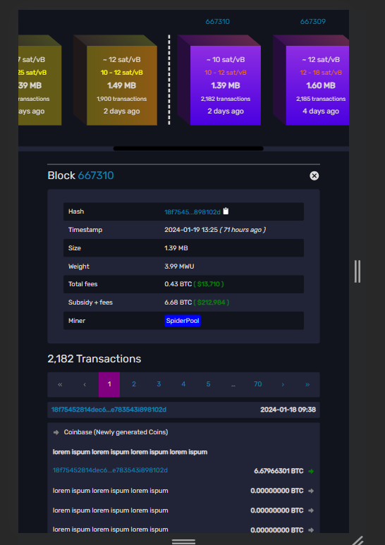
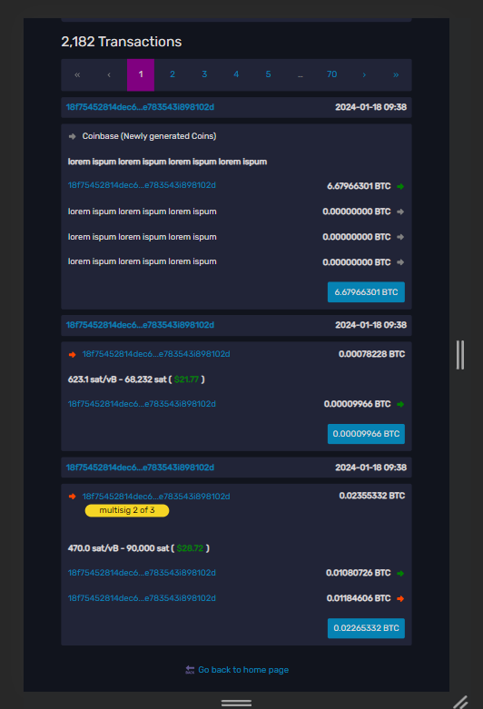

# 🌐⛓️ Zupple Labs

This is a practical coding assessment for the frontend developer intern role in Zupple Labs. I am eagerly looking forward to the opportunity and collaborating with the team.

## 💭 Assumptions

### Screen 1 Assumption ( File Upload Form Page )

-   The authorization key field has a length limit of 10 characters.
-   The title field can contain a maximum of 10 characters.
-   The description field allows a maximum of 50 characters.
-   Uploaded files must not exceed 5 MB 

These assumptions are made to prevent overloading the server with large payloads.

Some additional assumptions : 

- Users are restricted from selecting a future date; only today's date or any past date within the last 100 years is allowed.
-  Supported thumbnail image formats include .jpg, .jpeg, .png, and .webp.
-  Only PDF files are accepted as the source file format.

### Screen 2 assumptions ( Blockchain Explore Page )
- There are two types of blocks: those displayed in the violet gradient have been incorporated into a network, while those in the yellow gradient are pending addition to the network.
- Users can access detailed information, including transaction history, for the blocks already added to the network.
- Detailed information for blocks not yet added to the network is not visible to the user.
- Upon page load, the details of the most recently added block to the network will be presented.
- Recently conducted transactions, along with block information, are fetched from a cache instance. Additional transactions are fetched from the database as users navigate through the pages.

## Features

### Form Page

- Form validation on submitting the form

### Blockchain Explore Page

- Functional pagination of transaction history.
- Hash value copied to clipboard ( functional ).
- Modal displaying info about the blocks can be closed by clicking on the cancel button present at top left corner.


**Lazy loading of pages to reduce chunk sizes send over network. This results in increased performance.**

## 🛠️ Tech Stack Used

- HTML / CSS / JS
- React JS + Typescript ( Vite )
- Some Material UI components like Textfield, Button, Autocomplete, etc.
- Zod for form validation
- Axios for API call

## 🚀⚙️ Deployment Link

https://zupple-labs.vercel.app/

(Deployed on Vercel like we discussed over mail)

## 🖼️ Screenshots

### Form Page

- Desktop View : (This is a scrollable page)



- Mobile View : (Zoomed out to 50%. This is also a scrollable page)



### Blockchain Explore Page

- Desktop View : (This is a scrollable page)





- Mobile View (Zoomed out to 50%. This is also a scrollable page)



## 💻 Local Setup

The following steps will get you up and running :

1. Fork the repo (click the <kbd>Fork</kbd> button at the top right of
   [this page](https://github.com/Bismay5467/ZuppleLabs))

2. Clone your fork locally
   ```sh
   git clone https://github.com/Bismay5467/ZuppleLabs.git
   ```
3. Setup all the dependencies and packages by running `npm install` after moving to ZuppleLabs directory. This command will install all the global dependencies.

4. Start the development server by executing the command `npm run dev`

Now you are good to go!! Start collaborating to add more features! 🚀✨

Additional commands : 

- `npm run build && npm run preview` to build the project and start the production server.
- `npm run lint` to check for linting
